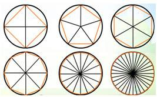
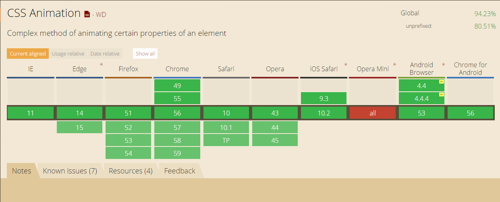
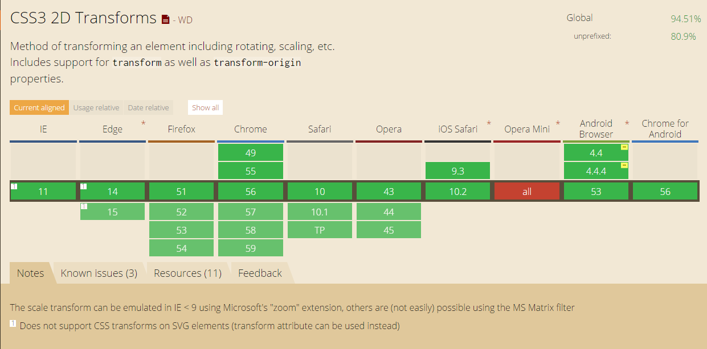
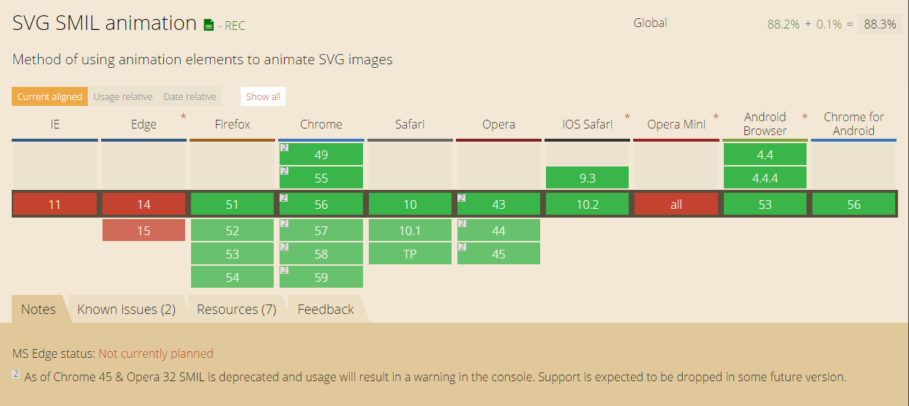

title: CSS3/SVG动画实现简易版行星运动
categories: 前端
tags: [svg, css3]
---

前端实现动画的手段非常丰富，有Canvas，JS+DOM，CSS3，SVG等。本文以近期项目中的动画为例，介绍CSS3和SVG两种CSS3&SVG动画实现简易版行星运动的方式。


## 动画拆解

这个动画很简单，每个小球在各自的轨道上，围绕中心旋转。

以其中一个小球为例，动画可拆解为两部分：

1. 小球自身属性的变化：距离越远，半径越小、亮度越低；
2. 小球沿着轨迹的运动：围绕中心公转。

我们暂定一轮动画持续时间为10s，介绍如何实现并组合这两部分动画。

## 小球自身属性的变化

### CSS3

首先需要画一个圆，利用`border-radius`属性，很容易就能实现：

```html
<div class="circle"></div>
```

```css
.circle {
  background-color: #fff;
  height: 30px;
  width: 30px;
  border-radius: 15px;
}
```

接着，定义CSS3动画，实现半径与透明度的变化：

```css
.planet-animation {
    animation-name: planetAnimation;
    animation-duration: 10s;
    animation-timing-function: linear;
    animation-delay: 0;
    animation-iteration-count: infinite;
    animation-direction: normal; 
}

@keyframes planetAnimation {
  0% { 
    opacity: 1;
    transform: scale(1, 1);
  }
  50% {
    opacity: .5;
    transform: scale(0.5, 0.5);
  }
  100% { 
    opacity: 1;
    transform: scale(1, 1);
  }
}
```

最后将动画应用于小球上：

```html
<div class="circle planet-animation"></div>
```

详情可见：

<p data-height="265" data-theme-id="0" data-slug-hash="zZKdWr" data-default-tab="css,result" data-user="lizijie1993" data-embed-version="2" data-pen-title="zZKdWr" class="codepen">See the Pen <a href="http://codepen.io/lizijie1993/pen/zZKdWr/">zZKdWr</a> by lizijie (<a href="http://codepen.io/lizijie1993">@lizijie1993</a>) on <a href="http://codepen.io">CodePen</a>.</p>
<script async src="https://production-assets.codepen.io/assets/embed/ei.js"></script>

### SVG

同样的，首先画一个圆：

```html
<svg width="100px" height="100px" xmlns="http://www.w3.org/2000/svg" xmlns:xlink="http://www.w3.org/1999/xlink">
    <circle cx="50" cy="50" r="15" fill="rgba(255, 255, 255, 1)">
    </circle>
</svg>
```

接下来添加动画：

```html
<svg width="100px" height="100px" xmlns="http://www.w3.org/2000/svg" xmlns:xlink="http://www.w3.org/1999/xlink">
    <circle cx="50" cy="50" r="15" fill="rgba(255, 255, 255, 1)">
        <animate attributeName="opacity" values="0.5;1;0.5;0.5" begin="0s" dur="10s" repeatCount="indefinite" keytimes="0;0.5;1;1"></animate>
        <animate attributeName="r" values="6;15;6;6" begin="0s" dur="10s" repeatCount="indefinite" keytimes="0;0.5;1;1"></animate>
    </circle>
</svg>
```

详情可见：

<p data-height="265" data-theme-id="0" data-slug-hash="WpGEBB" data-default-tab="html,result" data-user="lizijie1993" data-embed-version="2" data-pen-title="WpGEBB" class="codepen">See the Pen <a href="http://codepen.io/lizijie1993/pen/WpGEBB/">WpGEBB</a> by lizijie (<a href="http://codepen.io/lizijie1993">@lizijie1993</a>) on <a href="http://codepen.io">CodePen</a>.</p>
<script async src="https://production-assets.codepen.io/assets/embed/ei.js"></script>

### 对比

以上相比较而言，SVG动画代码更加纯粹，只需要编写对应的标签及属性，无需编写CSS。

## 小球沿着轨迹的运动

### CSS3

我们可以类似求圆周长一样，将轨迹划分成很多线段，然后设置动画，让小球移动。



代码类似

```css
@keyframes circle {
  0% { 
    transform: translate(0, 0);
  }
  2% {
    transform: translate(5px, 5px);
  }
  // ...
  100% {
    transform: translate(0, 0);
  }
}
```

这样会耗费大量时间coding，且效果并不好。我们可以考虑将运动拆分成**水平和垂直**两部分。

<p data-height="265" data-theme-id="0" data-slug-hash="OpRGoE" data-default-tab="css,result" data-user="lizijie1993" data-embed-version="2" data-pen-title="OpRGoE" class="codepen">See the Pen <a href="http://codepen.io/lizijie1993/pen/OpRGoE/">OpRGoE</a> by lizijie (<a href="http://codepen.io/lizijie1993">@lizijie1993</a>) on <a href="http://codepen.io">CodePen</a>.</p>
<script async src="https://production-assets.codepen.io/assets/embed/ei.js"></script>

### SVG

SVG添加轨迹很简单：

```html
<svg width="600px" height="500px" xmlns="http://www.w3.org/2000/svg" xmlns:xlink="http://www.w3.org/1999/xlink">
    <circle cx="100" cy="100" r="15" fill="rgba(255, 255, 255, 1)">
        <animatemotion path="M100.5,253a157.5,118 0 1,0 315,0a157.5,118 0 1,0 -315,0" begin="0s" dur="10s" repeatCount="indefinite"></animatemotion>
        <animate attributeName="opacity" values="0.5;1;0.5;0.5" begin="0s" dur="10s" repeatCount="indefinite" keytimes="0;0.5;1;1"></animate>
        <animate attributeName="r" values="6;15;6;6" begin="0s" dur="10s" repeatCount="indefinite" keytimes="0;0.5;1;1"></animate>
    </circle>
</svg>
```

<p data-height="265" data-theme-id="0" data-slug-hash="peEGZE" data-default-tab="html,result" data-user="lizijie1993" data-embed-version="2" data-pen-title="peEGZE" class="codepen">See the Pen <a href="http://codepen.io/lizijie1993/pen/peEGZE/">peEGZE</a> by lizijie (<a href="http://codepen.io/lizijie1993">@lizijie1993</a>) on <a href="http://codepen.io">CodePen</a>.</p>
<script async src="https://production-assets.codepen.io/assets/embed/ei.js"></script>

### 对比

CSS3实现轨迹，只能取大量点模拟或者对运动进行X、Y轴拆分。当轨迹不规则时，模拟的代价非常巨大，而SVG动画则能很轻易的实现。

## 兼容性

### CSS Animation兼容性


### CSS3 Transform 2D兼容性


### SVG SMIL动画兼容性


## 其他

SVG动画是基于SMIL（同步多媒体集成语言）的，可以参考[超级强大的SVG SMIL animation动画详解](http://www.zhangxinxu.com/wordpress/2014/08/so-powerful-svg-smil-animation/)了解更多。