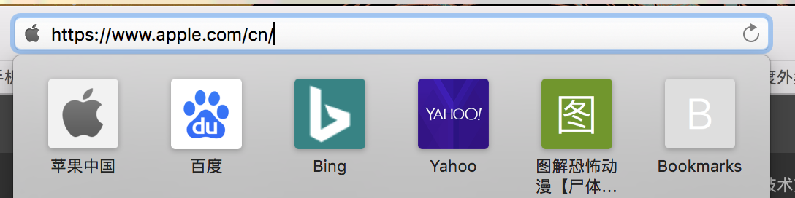
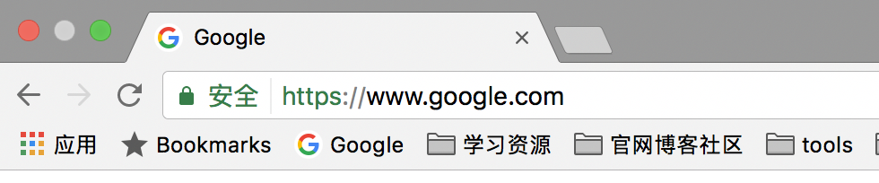
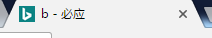
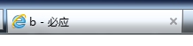
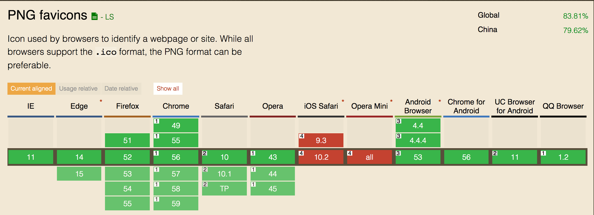
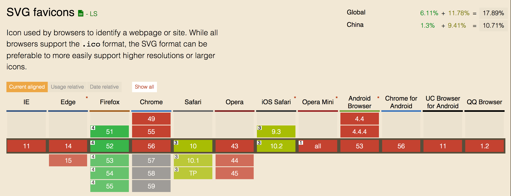
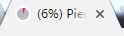
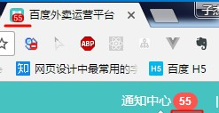
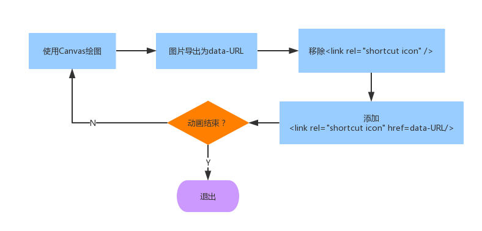
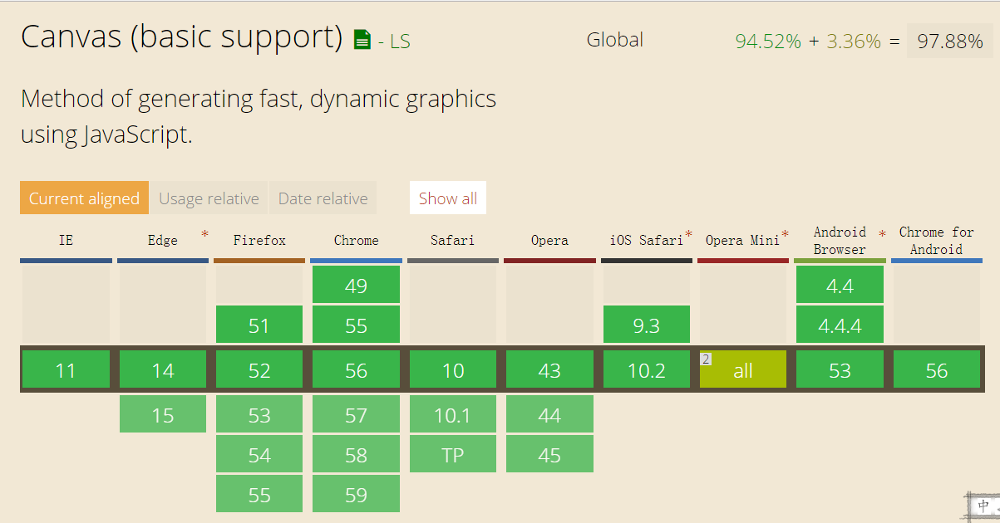

title: favicon
tags:
---

## 介绍

Favicon，即*favorites icon*，使浏览器收藏夹中的网页，不仅能显示网页的标题，还能显示这个网页特定的icon。除此之外，在一些浏览器中，tab上、搜索栏中，也能显示这个icon。

搜索栏：


Tab&收藏夹：


## 引入

在页面的头部，使用`<link>`标签引入。

```html
<link rel="shortcut icon" href="http://example.com/favicon.ico" type="image/vnd.microsoft.icon" sizes="16x16" />
```

图标可以通过`href`属性指向某个远程的地址，但部分老旧的浏览器不支持`<link>`标签设置favicon的地址，只会从网站的根目录`/favicon.ico`查找，因此如果需要兼容老旧浏览器，则需要将`favicon.ico`放置在网站根目录。（自测IE7支持，基本可以不用考虑这点）

## 格式

常见格式为`.ico`，基本所有的浏览器都支持这个格式。除此之外，部分浏览器支持`.png`、`.svg`、`.gif`等。若引用了不支持的格式，则会显示浏览器默认图标，例如：

[Bing](http://cn.bing.com/search?q=b&src=IE-SearchBox&FORM=IE8SRC)通过`href`引入了后缀为`.ico`但实际为png格式的图片：

```html
<link href="/sa/simg/bing_p_rr_teal_min.ico" rel="shortcut icon">
```

Chrome打开，能正常显示对应icon：



而IE9打开无法显示：



详细兼容性如下：

[Can I use favicon?](http://caniuse.com/#search=favicon)



## 动态favicon

有些网站的favicon是动态的：



有些网站的favicon包含与页面相关的内容，例如运营后台的icon，会显示当前账户未读的通知数：



`.gif`格式的favicon在部分浏览器能实现动态的效果。但要展现与页面内容相关的信息，还是得借助javascript。业内有一些开源的库，可以实现相关功能：

* [favico](https://github.com/ejci/favico.js)
* [Tinycon](https://github.com/tommoor/tinycon)
* [piecon](https://github.com/lipka/piecon)

### 原理

[piecon](https://github.com/lipka/piecon)实现的动画参考了[Tinycon](https://github.com/tommoor/tinycon)，与[favico](https://github.com/ejci/favico.js)一样，都是基于Canvas，原理大致如下：



兼容性考虑Canvas即可：



## 结语

favicon在一个网站中可能并不起眼，但能对它做一些细致的设计，能让你的网站更加精致。